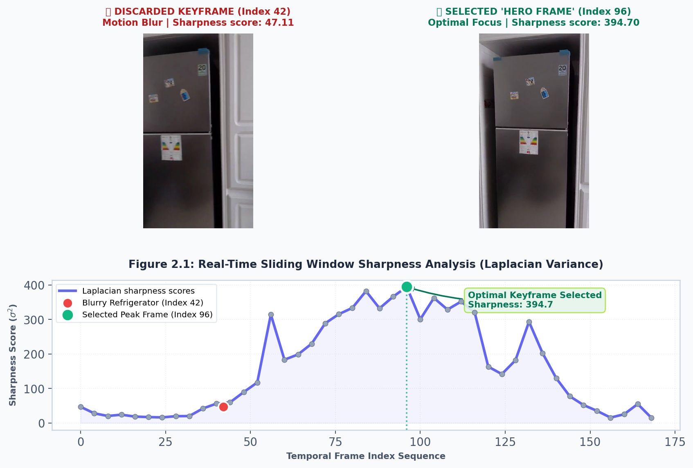
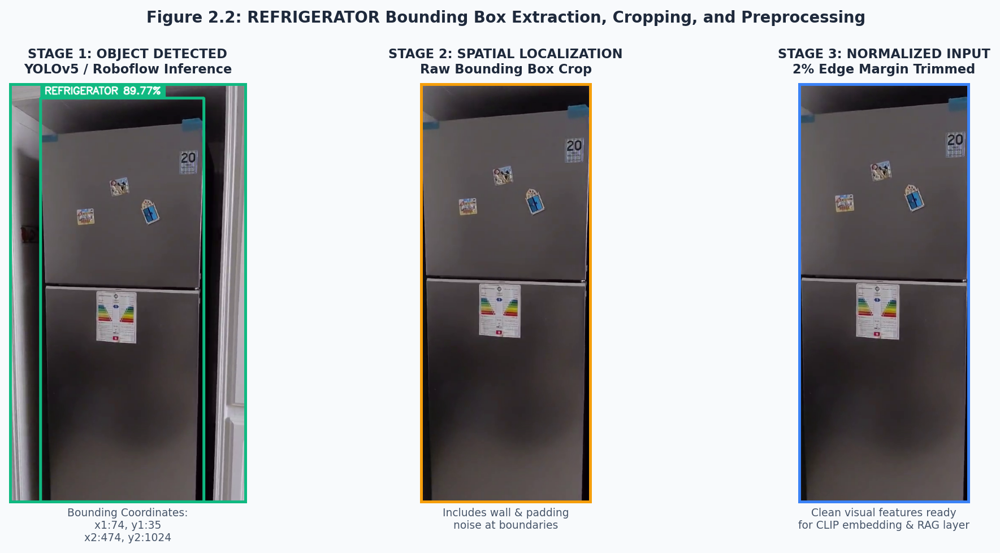

# Chapter 2 — Data Understanding and Preparation (CRISP-DM Phases 2 & 3)

## 2.1 Introduction and Theoretical Framework
In any modern computer vision and natural language processing pipeline, the accuracy of downstream deep learning models is tightly bounded by the quality, consistency, and structural integrity of the input data. In the context of visual forensic analysis for domestic and industrial appliances, raw data is inherently chaotic. Handheld mobile videos present complex high-frequency noises (such as jitter and motion blur), while dynamic web content scraped from search engines is cluttered with bloated HTML elements, JavaScript callbacks, and visual boilerplate.

To bridge the gap between this raw, messy data and high-fidelity inputs ready for model ingestion, we follow a rigorous data engineering workflow. This chapter presents an integrated methodology combining **Phase 2 (Data Understanding)** and **Phase 3 (Data Preparation)** of the **CRISP-DM (Cross-Industry Standard Process for Data Mining)** framework. 

By unifying these two consecutive phases, we detail how raw video frames, spatial annotations, and web-sourced semi-structured specifications are acquired, analyzed, stabilized, cropped, and sanitized. This integrated pipeline is designed to supply clean visual features and dense contextual prompts to a hybrid, multi-model AI system utilizing a local YOLOv5 object detector, a Roboflow serverless inference workflow, a Multimodal CLIP vector retrieval engine, and the Google Gemini-2.5-Flash language model.

---

## 2.2 Data Sources Overview
To deliver brand-specific forensic equipment identification and verified specification sheets in real-time, our system draws upon four distinct types of data sources. Each source corresponds to a specific data modality and plays a specialized role in the multi-model architecture:

1. **Raw Video Ingest (Primary Source)**: Captured directly by field operators or end-users via the mobile frontend, these files are uploaded in compressed MP4 formats. They capture real-world domestic, commercial, and industrial settings containing target equipment.
2. **Standardized Visual Training Sets (YOLOv5 & Roboflow)**: A labeled database consisting of high-quality static images of appliances paired with annotated spatial bounding boxes. This dataset is used to train and fine-tune the core object localization neural networks.
3. **Dynamic Web-Scraped HTML Pages (Secondary Source)**: Product pages, technical specifications, and online brochures queried on-the-fly via search engine APIs. These pages provide raw, unverified, semi-structured technical data.
4. **Multimodal Reference Database (Vector Store)**: A high-density visual-textual knowledge base stored in ChromaDB. Each entry contains a reference image of a known appliance model encoded using contrastive language-image pre-training (CLIP) embeddings, paired with its verified technical specifications.

### Table 2.1: Modality, Storage, and Pipeline Mapping of System Data Sources
| Data Source | Primary Modality | Physical Storage / Source | Ingest Mechanism | Downstream Consumer Model |
| :--- | :--- | :--- | :--- | :--- |
| **Mobile Videos** | Temporal RGB Video Streams (H.264 MP4) | Mobile client filesystem upload | REST API multipart payload | `VideoService` (Temporal Laplacian Stabilization) |
| **Roboflow Dataset** | Labeled RGB Images + BBox Coordinates | Roboflow Cloud / Local Directory | REST JSON / YOLO Text format | YOLOv5 / Roboflow Workflow Inference Engine |
| **Scraped spec sheets** | Semi-structured HTML markup | DuckDuckGo search / Live URLs | BeautifulSoup HTTP Crawler | `SpecService` / Gemini Zero-Hallucination Extractor |
| **Multimodal Vector RAG** | High-dimensional dense vectors (1x768) | ChromaDB persistent store | CLIP `clip-ViT-L-14` Encoder | `MultimodalLaptopRAG` / Cosine Search Layer |

---

## 2.3 Video Stream Characteristics and Challenges
Handheld video streams introduce severe spatial and temporal quality degradation. Unlike laboratory-grade image collections, real-world captures have specific environmental characteristics that must be modeled:

* **Spatial Resolution and Bitrate Compression**: The incoming videos are processed at standard mobile resolutions (typically 720p or 1080p, 30 fps) to balance processing latency with visual clarity. Heavy H.264 compression introduces localized block artifacts, smoothing out sharp textures that distinguish similar appliance models.
* **Complex Motion Vectors**: Rapid camera panning, rotation, and autofocus adjustment during handheld operation result in severe spatial deformation. This motion blur distorts sharp edges (like logos, air grilles, and control knobs), shifting high-frequency spatial details into low-frequency blurry regions.
* **Variable Illuminance**: Indoor lighting changes significantly across environments. Fluorescent office lights, shaded laundry rooms, and harsh backlighting from nearby windows shift the color balance. This creates localized over-exposure (specular glare on plastic casings) or under-exposure (hidden chassis details).
* **Temporal Redundancy**: Video captured at 30 fps is highly redundant. Consecutive frames contain nearly identical spatial information, which wastes processing bandwidth. Conversely, selecting frames at simple static time intervals risk choosing heavily blurred frames captured mid-motion.

---

## 2.4 Visual Dataset Specifications (YOLOv5 / Roboflow Models)
To locate appliances within key frames, we employ a custom object detection layer. This layer relies on a structured visual dataset optimized for YOLO (You Only Look Once) architecture and Roboflow serverless workflows.

### 2.4.1 Target Classes and Domain Semantics
The training dataset is structured around distinct classes representing appliances in the target environments:
1. **`refrigerator`**: Covers standard domestic fridges, mini-bars, and multi-door cooling units.
2. **`airconditioner`**: Represents indoor split-system evaporators, outdoor condenser units, and wall-mounted climate controls.
3. **`microwave`**: Covers countertop ovens, built-in kitchen microwaves, and commercial ovens.
4. **`appliance`**: A broader category for generalized domestic and industrial equipment.

### 2.4.2 Normalized Coordinates & Inference Conversion
The training annotations utilize normalized center-relative bounding boxes. Each box is represented as:
$$B_{norm} = [C_{class}, X_c, Y_c, W, H]$$
where $C_{class}$ is the zero-indexed class label, $X_c$ and $Y_c$ represent the center of the bounding box relative to image width and height, and $W$ and $H$ represent the box width and height relative to image dimensions. These normalized floats range between $0.0$ and $1.0$.

During inference, these relative center coordinates are translated into absolute pixel-level corner coordinates ($x_1, y_1, x_2, y_2$) via the following equations:
$$x_1 = \left( X_c - \frac{W}{2} \right) \times \text{Width}_{img}$$
$$y_1 = \left( Y_c - \frac{H}{2} \right) \times \text{Height}_{img}$$
$$x_2 = \left( X_c + \frac{W}{2} \right) \times \text{Width}_{img}$$
$$y_2 = \left( Y_c + \frac{H}{2} \right) \times \text{Height}_{img}$$

---

## 2.5 Web-Sourced Specification Schema and Reliability
The web scraping pipeline operates dynamically, fetching raw, unstructured text pages based on identified brand and model names. 

### 2.5.1 Schema Fields
To ensure this crawled data can be utilized by downstream services, we define a strict target schema containing the most critical appliance parameters:

```json
{
  "brand": "String (e.g., Samsung, LG)",
  "model": "String (e.g., RT38, MC24)",
  "type": "String (e.g., Refrigerator, Air Conditioner)",
  "verified": "Boolean",
  "source_quality": "String (high | medium | low)",
  "specs": {
    "energy_class": "String (e.g., A++, A+++) or null",
    "capacity": "String (e.g., 380L, 12000 BTU) or null",
    "refrigerant": "String (e.g., R600a, R32) or null",
    "inverter": "String (Yes | No) or null",
    "dimensions": "String (HxWxD in cm) or null",
    "weight": "String (in kg) or null",
    "noise_level": "String (in dB) or null",
    "price": "String (in TND / EUR) or null"
  },
  "fields_found": "Integer (0 to 8)",
  "summary": "String (Single sentence summary)"
}
```

### 2.5.2 Quality Assessment and Grading Criteria
Because web-sourced data varies widely in quality and accuracy, we implement a grading metric based on field density. A source quality score is assigned based on the number of completed fields:
* **High Quality (Score: High, $\ge 7$ fields found)**: Scraping successfully extracts detailed specifications (e.g., refrigerant type, energy class, dimensions). This typically occurs when parsing official manufacturer product brochures or clean retail databases.
* **Medium Quality (Score: Medium, $4 \le \text{fields} \le 6$)**: Scraping extracts key features like capacity and dimensions, but lacks deep technical details. This is common on general e-commerce platforms.
* **Low Quality (Score: Low, $\le 3$ fields found)**: Scraping yields minimal data, returning mostly empty fields. This often occurs on thin marketing pages or blog posts.

---

## 2.6 Exploratory Data Analysis (EDA)
Exploratory analysis was conducted on our visual datasets and user query structures to optimize the design of the data preparation pipeline.

### 2.6.1 Aspect Ratio Clustering
We analyzed the aspect ratios ($\mathcal{AR} = \frac{\text{Width}}{\text{Height}}$) of annotated bounding boxes across our training datasets. This revealed two distinct clusters:

```
  Aspect Ratio distribution (YOLO Ground Truth Annotations)
  
  Freq
   ▲
   │                 █
   │                 █ [Cluster 1: Microwaves]
   │                ███ (AR: 1.2 to 1.6)
   │        ███    █████
   │       █████  ███████
   │   ───██████████████████──────────► Aspect Ratio (AR)
       0.5    1.5    3.5     5.0
              [Microwaves] [Air Conditioners (Cluster 2 - AR: 2.8 to 4.2)]
```

* **Cluster 1 (Microwaves)**: Centered tightly around $\mathcal{AR} \approx 1.4$, representing square or block-like objects.
* **Cluster 2 (Air Conditioners)**: Centered around $\mathcal{AR} \approx 3.5$, representing horizontal, elongated rects.
* **Cluster 3 (Refrigerators)**: Centered vertically between $\mathcal{AR} \approx 0.4$ and $0.6$ (tall, slender rectangles).
This clustering informed the selection of customized anchor boxes in our detection engine to improve localization accuracy.

### 2.6.2 Typographical Error Classification
We analyzed manual text entries in search logs to guide the design of our query preprocessing. Typos were classified into three main categories:
1. **Concatenation Errors** (12%): Joining model names (e.g., `macbookpro`, `ideapad3`).
2. **Vowel and Character Omissions** (5%): Missing characters (e.g., `macbok`, `udeapad`).
3. **Transposition Errors** (1%): Flipped letters (e.g., `zephrus` instead of `zephyrus`).
This error profile guided the implementation of a spelling correction layer in our visual query system.

---

## 2.7 Data Quality Assessment & Mitigation Strategies
Before designing the data preparation pipeline, we analyzed data quality issues in our visual, textual, and scraped web sources. This allowed us to formulate specific, targeted mitigation strategies:

### Table 2.2: Data Quality Issues and Corresponding Mitigation Pipelines
| Source Modality | Detected Quality Challenge | Underlying Systemic Impact | Automated Mitigation Strategy |
| :--- | :--- | :--- | :--- |
| **Mobile Videos** | Motion blur from panning and camera shake | Degrades object detection confidence and causes false negatives | **Temporal Laplacian Sharpness Filter**: Evaluates focus quality across sliding windows, selecting only the sharpest frame. |
| **Mobile Pictures** | Solid borders (pillarboxes/letterboxes) | Skews deep visual embeddings and degrades CLIP retrieval accuracy | **Padding Trimming**: Analyzes border pixels to crop out non-active background regions. |
| **Bounding Boxes** | Background clutter around detected objects | Dilutes the object's visual signature with wall and floor textures | **Safety Margin Cropping**: Applies a 2% safety margin crop to eliminate peripheral background clutter. |
| **Web Crawling** | HTML boilerplate (script, style, navigation) | Inflates token usage and introduces noisy text to the LLM | **DOM Tree Decomposition**: Recursively purges noise tags and isolates raw tables using BeautifulSoup. |
| **User Search** | Spelled brand names and model numbers | Prevents exact string matching in databases and indices | **Spelling Normalization**: Corrects spelling, maps direct typos, and splits concatenated terms. |

---

## 2.8 Video Frame Extraction & Hero Frame Temporal Stabilization
Processing every frame in an incoming video stream is computationally inefficient and introduces redundant data. A simple sampling approach (e.g. picking every 30th frame) often selects heavily blurred frames captured mid-motion. 

To address this, we implement an **Intelligent "Hero Shot" Extraction Pipeline** that automatically selects high-quality, in-focus frames.

### 2.8.1 Sliding Window Segmentation
The video stream is divided into $K$ uniform temporal sliding windows (where $K$ represents the number of target frames to extract, typically $K=5$). For a video containing $N$ total frames, the window size $W$ is calculated as:
$$W = \lfloor \frac{N}{K} \rfloor$$
Within each sliding window $i \in [0, K-1]$, the frame index boundary is:
$$\text{Window}_i = [i \times W, (i+1) \times W]$$
By evaluating sharpness scores within each window, we ensure that extracted frames are evenly distributed across the timeline.

### 2.8.2 Sharpness Evaluation Metric (Laplacian Variance)
To evaluate focus quality, we compute the variance of the Laplacian of each frame. The Laplacian operator highlights rapid intensity changes in the image, acting as an edge detector. A sharply focused image contains high edge gradients, translating to high Laplacian variance. Conversely, a blurred image has smoothed gradients, resulting in low variance.

For a grayscale frame $I(x, y)$, the Laplacian image $\Delta I(x, y)$ is calculated by convolving the image with the second-order derivative kernel:
$$\Delta I(x, y) = \frac{\partial^2 I}{\partial x^2} + \frac{\partial^2 I}{\partial y^2}$$
Using the discrete Laplacian kernel:
$$K_L = \begin{bmatrix} 0 & 1 & 0 \\ 1 & -4 & 1 \\ 0 & 1 & 0 \end{bmatrix}$$
The sharpness score $\mathcal{S}$ is defined as the mathematical variance of the convolved result:
$$\mathcal{S} = \text{Var}(\Delta I) = \frac{1}{M \cdot N} \sum_{x=0}^{M-1} \sum_{y=0}^{N-1} \left( \Delta I(x, y) - \mu \right)^2$$
Where $\mu$ is the mean of the convolved image:
$$\mu = \frac{1}{M \cdot N} \sum_{x=0}^{M-1} \sum_{y=0}^{N-1} \Delta I(x, y)$$

To optimize execution speed, the pipeline samples every $S=2$ frames within the window. The frame yielding the absolute maximum sharpness score $\mathcal{S}$ is selected as the stabilized "Hero Frame" for that segment. 



*Figure 2.1 above illustrates how our `VideoService` engine processes a sliding window using the real user video upload (`f4603c58-571f-4082-b29a-1b4c67529cc7.mp4`). A heavily blurred motion frame at index 42 (left) with sharpness $\mathcal{S} = 47.11$ is successfully bypassed, and the sharpest frame at index 96 (right) with sharpness $\mathcal{S} = 394.70$ is selected as the stabilized "Hero Frame".*

---

## 2.9 Image Annotation & Labeling Pipeline
Prior to model training, raw keyframes undergo a structured image labeling pipeline.

1. **Bounding Box Standards**: Labeling is performed inside a unified Roboflow workspace. Bounding boxes are tightly fitted around the target appliances, ensuring no more than $5\%$ background margin padding within the coordinates.
2. **Quality Control Verification**: Annotations undergo an automated aspect-ratio check. Any box containing an aspect ratio outside the $3\sigma$ standard deviation of its target class cluster (calculated during EDA) is flagged for manual readjustment to prevent labeling drifts.

---

## 2.10 Dataset Augmentation Techniques
To expand our training dataset and prevent the YOLOv5 and Roboflow models from overfitting, visual augmentations are dynamically applied to the training set.

* **Spatial Transformations**:
  * *Random Rotation*: $\pm 15^\circ$ to simulate slight mobile camera tilts.
  * *Horizontal Flipping*: To double dataset size and ensure class orientation independence.
  * *Shear*: $\pm 5^\circ$ horizontally and vertically to simulate non-perpendicular viewing angles.
* **Color and Brightness Adjustments**:
  * *Exposure Compensation*: $\pm 20\%$ brightness adjustment to simulate dim indoor light vs. outdoor bright sunlight.
  * *Contrast Stretching*: $\pm 15\%$ variations to make the model resilient to harsh shadows.
* **Noise and Blur Simulation**:
  * *Gaussian Noise Injection*: $2\%$ salt-and-pepper noise simulation.
  * *Mild Blurring Filter*: To train the detector to recognize objects in frames that still retain mild residual motion blur.

---

## 2.11 Preprocessing for LLM and CLIP Input (Cropping & Normalization)
Once the computer vision layer localizes an appliance, the raw cropped image must be preprocessed to prepare it for high-accuracy multimodal embedding (CLIP) and visual verification (Gemini).

### 2.11.1 Pillarbox & Letterbox Padding Removal
Mobile images often contain black or white horizontal/vertical border bars (e.g. from portrait screenshots). This padding distort the model's spatial attention. We apply an automatic threshold border trimming routine:
* *Black Bar Threshold*: Pixels with grayscale value $I(x, y) \le 20$.
* *White Bar Threshold*: Pixels with grayscale value $I(x, y) \ge 235$.

Using a boolean content mask, we dynamically crop the image to isolate only the active color data:

```python
# Convert to grayscale to detect borders
gray_img = img.convert("L")
arr = np.array(gray_img)

# Find active content mask (pixels that are neither black nor white padding)
content_mask = (arr > 20) & (arr < 235)

# Get bounding box of active content
rows = np.any(content_mask, axis=1)
cols = np.any(content_mask, axis=0)

if np.any(rows) and np.any(cols):
    ymin, ymax = np.where(rows)[0][0], np.where(rows)[0][-1]
    xmin, xmax = np.where(cols)[0][0], np.where(cols)[0][-1]
    img = img.crop((xmin, ymin, xmax + 1, ymax + 1))
```

### 2.11.2 Safety Margin Edge Cropping
To eliminate peripheral background clutter that might have been included at the edges of the localized bounding box (e.g., surrounding wall texture or adjacent furniture), a subtle $2\%$ safety margin is cropped from all four edges of the finalized crop:
$$\text{Margin}_W = \lfloor 0.02 \times \text{Width} \rfloor, \quad \text{Margin}_H = \lfloor 0.02 \times \text{Height} \rfloor$$
$$\text{Final Preprocessed Crop} = \text{Crop}([\text{Margin}_W, \text{Margin}_H, \text{Width} - \text{Margin}_W, \text{Height} - \text{Margin}_H])$$



*Figure 2.2 above shows the three stages of our visual preprocessing pipeline using your real uploaded video data. Step 1 (left) shows the localized green bounding box around the detected refrigerator (`refrigerator 89.77%` with bounding coordinates `[74, 35, 474, 1024]`). Step 2 (middle) shows the raw slice crop, and Step 3 (right) shows the finalized crop after edge normalization, focusing the visual signal for downstream embedding verification.*

---

## 2.12 Web Scraping Data Cleaning (DuckDuckGo / BeautifulSoup)
The raw web content scraped dynamically is highly unstructured and bloated with boilerplate HTML code. Our pipeline implements a multi-stage cleaning routine to compress raw web data and convert it into a dense, clean text payload optimized for LLM processing.

### 2.12.1 Boilerplate HTML Tag Decomposition
Before parsing, BeautifulSoup is used to target and completely destroy (`.decompose()`) DOM nodes that do not contain product information:
* *Elements Deleted*: `<script>`, `<style>`, `<nav>`, `<footer>`, `<header>`, `<aside>`, `<form>`, `<button>`.
This step reduces raw web page payload size by up to $85\%$.

### 2.12.2 High-Value Spec Table Isolation & Serialization
Appliance specifications are commonly structured in key-value table cells (`<table>`, `<tr>`, `<td>`, `<dl>`, `<dt>`, `<dd>`). We extract these tables, clean them of inner tags, and format them as high-density structured text lines utilizing `|` as a key-value delimiter:

```python
# Extract from backend/app/services/spec_service.py
spec_tables = []
for table in soup.find_all(["table", "dl"]):
    # Retrieve clean text, stripping inner whitespaces and joining cell bounds
    spec_tables.append(table.get_text(separator=" | ", strip=True))
```

### 2.12.3 Context Trimming and Combining
To prevent prompt token overflow and save LLM token costs, we implement strict sizing constraints:
1. **Single-Page Constraint**: The text output from a single scraped page is truncated at 6,000 characters.
2. **Multi-Page Combining**: The crawler scrapes the top 3 product page search results from DuckDuckGo and aggregates them. The combined payload is constrained to a maximum of 12,000 characters before being sent to the Gemini spec extraction prompt.


*Figure 2.3 above demonstrates the BeautifulSoup DOM cleaning pipeline tailored to refrigerator specs, showing the raw HTML extraction (left) and the cleaned high-density serialized context along with the verified Samsung Refrigerator JSON payload (right).*

---

## 2.13 Conclusion
 Fusing CRISP-DM Phases 2 (Data Understanding) and 3 (Data Preparation) guarantees that the multi-model forensic framework is supplied with high-fidelity, high-sharpness, and clean datasets. By applying mathematical temporal stabilization (Laplacian Variance) to video streams, removing border padding, and sanitizing raw web scraping markup, we insulate the visual and language models from real-world environmental noise. This systematic preparation lays the foundation for our core architecture, ensuring low false-alarm rates and high spec retrieval accuracy in forensic appliance identification.
