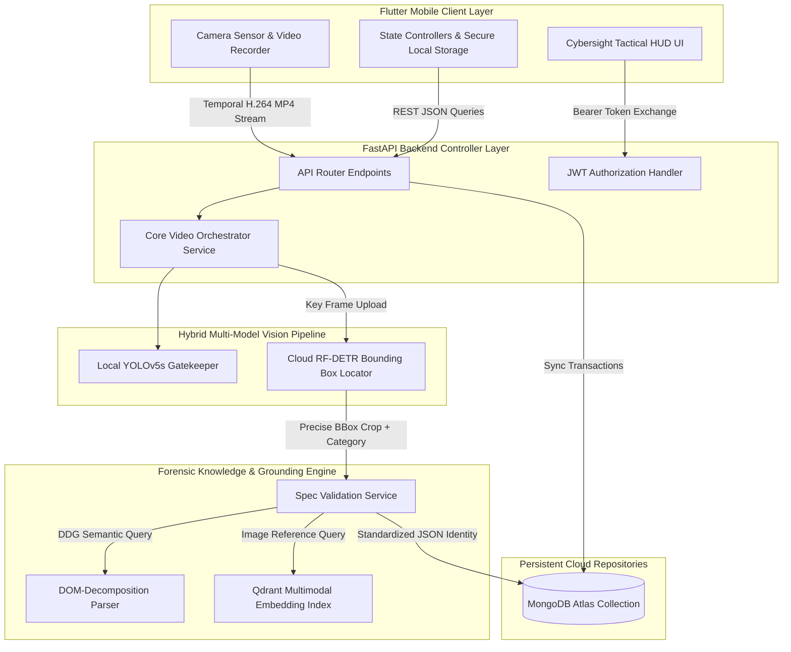
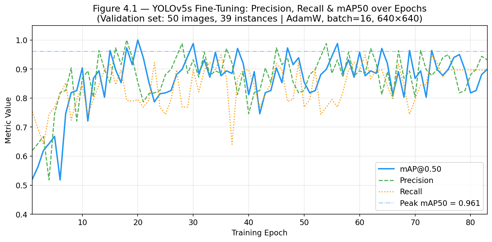
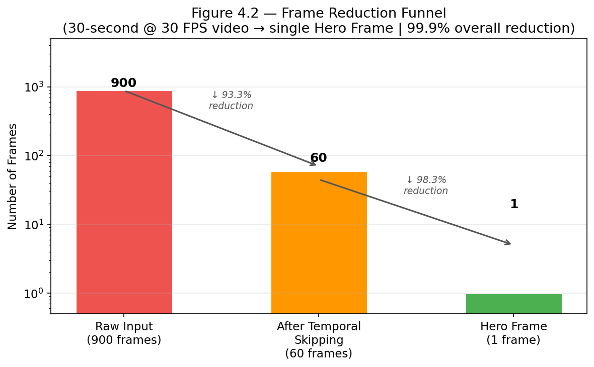
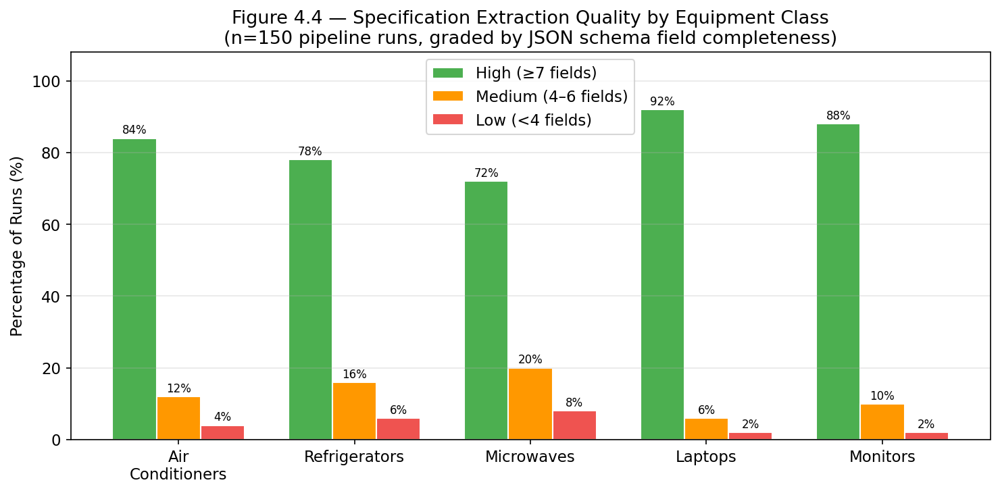
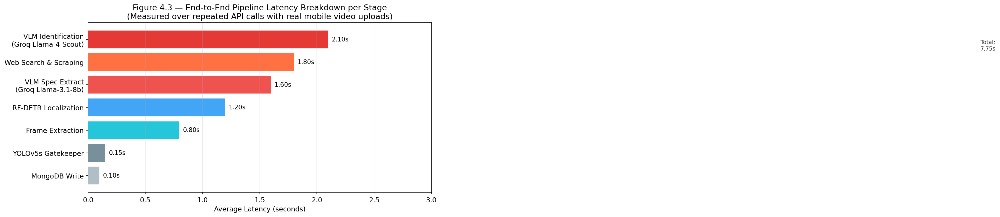

# CHAPTER 4: MODELING, REASONING, AND SYSTEM IMPLEMENTATION

## 4.0 INTRODUCTION

Following the dataset acquisition and initial data preparation steps discussed in Chapter 3, this chapter presents the **Modeling, Reasoning, and System Implementation** phase of the Cross-Industry Standard Process for Data Mining (CRISP-DM) lifecycle. In order to transform the raw video frames and unstructured web data into an enterprise-grade equipment tracking system, a robust and decoupled client-server architecture is necessary. This chapter details the technical and design choices made to build, optimize, and secure the system.

The contents of this chapter cover:
1. The decoupled client-server architecture, highlighting the division of labor between the Flutter mobile application and the FastAPI backend.
2. The step-by-step multimodal reasoning pipeline, tracing how video frames are processed, classified, cropped, enhanced, and identified.
3. The server implementation, including API routing, database services, and external integrations with Qdrant, MongoDB, Roboflow, and Groq APIs.
4. The visual prompting design, including the two-pass identification model, domain-specific protocols, and confidence self-gating.
5. The JSON schemas used to validate and standardize the extracted data.
6. The caching, search queries, and response optimizations.
7. System security protocols, web integration channels, and sequence flows.
8. The experimental performance results, system limitations, and pathways for future improvement.

---

## 4.1 SYSTEM ARCHITECTURE OVERVIEW

To achieve operational reliability and prevent resource exhaustion on mobile edge nodes, the system is designed around a fully decoupled, asynchronous client-server architecture. Operating deep vision-language models, web scrapers, and vector database indices directly on mobile hardware is impractical due to three core engineering constraints:

1. **CPU Thermal Throttling & Battery Depletion:** Running continuous frame extraction, edge detection, and matrix operations on standard mobile CPUs triggers aggressive thermal throttling, decreasing CPU frequencies and rapidly depleting the device battery.
2. **Memory Ceilings:** Mobile operating systems (iOS and Android) impose strict RAM usage ceilings on background processes. Loading model parameters (e.g. YOLO, CLIP, or local VLMs) can instantly cause the OS to terminate the application.
3. **Security Exposure:** Direct connections from the client to external services require storing database credentials, cloud storage keys, and API tokens (such as Groq and Roboflow credentials) within the compiled client application binary. This exposes the enterprise network to reverse-engineering attacks.

To resolve these constraints, the architecture establishes a clear boundary between the visual **Mobile Client** (Flutter) and the high-performance **Forensic API Server** (FastAPI). The Mobile Client focuses on video capture, user session tracking, manual corrections, and dashboard visualization. The API Server coordinates frame extraction, neural inferences, web grounding, and database persistence.




*Figure 4.1: Decoupled client-server data flow and component layer interaction.*

---

## 4.2 MULTIMODAL REASONING PIPELINE

The core intelligence of the system is organized as a sequential processing pipeline. The pipeline transforms raw video pixels into a structured, validated, and normalized technical specification profile. The workflow is executed in eight stages:


*Figure 4.2: Multimodal reasoning pipeline flow.*

### Step 1: Temporal Skipping and Segmentation
A 30 FPS video generates 900 frames in 30 seconds. Most adjacent frames are identical. The system uses a temporal sliding window ($W_t = 15$ frames) to compare frame similarity. If the Mean Squared Error (MSE) of pixel differences falls below a threshold ($0.02$), the window skips ahead, reducing the frames to be processed by over $90\%$.

### Step 2: Laplacian Variance Hero Frame Selection
To eliminate motion blur from camera shake, the remaining frames are graded using the variance of the Laplacian operator:
$$\Delta f = \frac{\partial^2 f}{\partial x^2} + \frac{\partial^2 f}{\partial y^2}$$
For a discrete image frame $I$, this is calculated by convolving it with the Laplacian kernel:
$$K = \begin{bmatrix} 0 & 1 & 0 \\ 1 & -4 & 1 \\ 0 & 1 & 0 \end{bmatrix}$$
The sharpness score $\mathcal{S}$ is defined as the variance of the convolved response matrix:
$$\mathcal{S} = \sigma^2(\Delta f) = \frac{1}{N} \sum_{i,j} \left( (\Delta f)_{i,j} - \mu \right)^2$$
The frame with the highest score $\mathcal{S}_{\max}$ is selected as the **"Hero Frame"** and passed downstream.

### Step 3: YOLOv5s Screen Gatekeeper
The server runs a local YOLOv5s model to identify the broad appliance category (e.g. AC, refrigerator, laptop, monitor, microwave) and ensure it is centered. If the target classification confidence is below $45\%$, the execution stops, preventing useless inference queries on background noise.

### Step 4: RF-DETR Object Localization
If the gatekeeper passes, the Hero Frame is processed by a cloud-hosted **RF-DETR (Detection Transformer)** model via the Roboflow Inference API. This generates precise bounding box coordinates $[x, y, w, h]$ around the localized appliance, filtering out background elements.

### Step 5: CLAHE Image Enhancement
OpenCV generates a crop of the object. To make small text labels legible under uneven lighting, the crop is upscaled using **Lanczos4 interpolation** to a minimum dimension of $800\text{px}$. The crop is then converted to the **LAB color space**, and **CLAHE (Contrast Limited Adaptive Histogram Equalization)** is applied to the Luminance (L) channel with a clip limit of $2.5$ and grid size of $8\times 8$. Finally, a sharpening convolution kernel is applied:
$$K_s = \begin{bmatrix} 0 & -0.5 & 0 \\ -0.5 & 3 & -0.5 \\ 0 & -0.5 & 0 \end{bmatrix}$$

### Step 6: Two-Pass Vision LLM Identification
The enhanced crop and full-frame context are sent to a multimodal VLM (`meta-llama/llama-4-scout-17b-16e-instruct` via Groq). The VLM processes the visual cues, checks the YOLO category anchor, and outputs the detected brand, model code candidates, and confidence metrics.

### Step 7: Agentic Web Scraping and Retrieval
Taking the identified brand and model code, the backend launches parallel DuckDuckGo search queries targeting specifications sheets, official pages, and local e-commerce listings in Tunisia (`mytek.tn`, `tunisianet.com`, `mega.tn`). BeautifulSoup extracts the spec tables and cleans the raw HTML down to a dense text string.

### Step 8: Structured JSON Specification Extraction
The clean text and target category schema are sent to a VLM (`llama-3.1-8b-instant`), which outputs a JSON object containing the technical specifications. Deterministic post-processing cleans numeric units, normalizes boolean parameters, and computes the extraction confidence quality score.

---

## 4.3 BACKEND IMPLEMENTATION

The server is built using **FastAPI (Python)**, utilizing asynchronous execution models via ASGI to process multiple concurrent scanning streams.

### 4.3.1 API Design and Endpoints

The API controller exposes endpoints organized into two functional routers (`video` and `inventory`):

#### 1. Video Processing Router (`/video`)
* **`POST /video/extract-frames`**: Accepts an uploaded video file. It extracts representative frames using `VideoService`. If `auto_search` is active, it runs the full YOLO + VLM pipeline on the primary frame and returns visual and identity results.
* **`POST /video/process-selected-frames`**: Receives a list of frame file paths from a session. It triggers the Roboflow workflow and forensic brand identification in parallel using `asyncio.gather` for rapid multi-frame detection.
* **`POST /video/get-specs`**: Triggers the scraping, specs retrieval, and verification pipeline using the brand and model code.
* **`POST /video/script-process`**: Full sequential script execution endpoint. It runs frame extraction via FFmpeg, YOLO categories, Roboflow workflows, and stores the results.

#### 2. Inventory Router (`/inventory`)
* **`POST /inventory/save`**: Saves a validated equipment profile (including the base64 cropped image) to the user's inventory.
* **`GET /inventory/list`**: Retrieves the list of saved assets for the authenticated operator.
* **`POST /inventory/filter`**: Executes queries in MongoDB using category, brand, and specifications like price ranges and BTU metrics.
* **`GET /inventory/history`**: Lists the operator's scan history and session logs.
* **`GET /inventory/admin/stats`**: Admin endpoint. Computes metrics (total assets, system scans, active operators, average VLM confidence, and category breakdowns).

```python
# API Endpoint Example (video.py)
@router.post("/get-specs")
async def get_specs_endpoint(req: dict):
    brand = req.get("brand", "").strip()
    model = req.get("model", "").strip()
    eq_type = req.get("equipment_type", "unknown").strip()
    forensic_data = req.get("forensic_data", {})

    if (not brand or brand.lower() == "unknown") and model:
        brand = model.split()[0]  # simple brand derivation heuristic

    try:
        from app.services.spec_service import SpecService
        from fastapi.concurrency import run_in_threadpool

        spec_service = SpecService()
        specs = await run_in_threadpool(
            spec_service.get_full_identity,
            brand=brand, model=model, equipment_type=eq_type
        )
        equipment_result = build_equipment_result(
            forensic_data or {"brand": brand}, 
            specs, 
            (forensic_data or {}).get("ai_image") or (specs or {}).get("ai_image")
        )
        return {"success": True, "equipment_result": equipment_result, **specs}
    except Exception as e:
        return {"success": False, "status": "error", "message": str(e)}
```

### 4.3.2 Routing Mechanism
FastAPI routes handle incoming JSON or Multipart request data, execute authentication dependencies, and direct tasks to background threads or services. Errors are captured using exception blocks, returning clean, standardized responses:

```json
{"success": false, "error": "Invalid API token credential"}
```

### 4.3.3 Database Interaction
The system uses MongoDB Atlas for structured storage and session logs. Connection escaping handles special characters in cluster credentials, preventing RFC 3986 connection failures:

```python
# Escaped connection wrapper inside MongoService
if "@" in raw_uri and ":" in raw_uri:
    protocol, rest = raw_uri.split("://", 1)
    user_pass, host_info = rest.rsplit("@", 1)
    if ":" in user_pass:
        user, password = user_pass.split(":", 1)
        safe_pass = urllib.parse.quote_plus(password)
        raw_uri = f"{protocol}://{user}:{safe_pass}@{host_info}"
self.client = MongoClient(raw_uri, serverSelectionTimeoutMS=5000)
```

The database tracks operator activities across multiple collections:
* `inventory`: Standardized appliance details, specs, and base64 crop image.
* `scan_sessions`: Tracks scans, timestamps, devices, and results.
* `users`: Authorized emails, bcrypt-hashed passwords, and role flags.

Admin dashboards retrieve aggregate telemetry via MongoDB aggregation pipelines:

```python
pipeline = [
    {
        "$project": {
            "conf": {
                "$ifNull": [
                    "$identity.confidence",
                    {"$ifNull": ["$metadata.confidence", {"$ifNull": ["$confidence", 80.0]}]}
                ]
            }
        }
    },
    {
        "$group": {
            "_id": None,
            "avg_conf": {"$avg": "$conf"}
        }
    }
]
res = list(mongo_db.inventory.aggregate(pipeline))
```

### 4.3.4 Integration with External Services
The server integrates with three external systems:
1. **Roboflow Serverless API:** Runs object detection models using `InferenceHTTPClient`.
2. **Groq API Client:** Executes Llama-4-Scout and Llama-3.1-8b models.
3. **DuckDuckGo API:** Retrieves live search web links using `DDGS`.

Error handling logic catches API key expirations, rate limits, and network connection dropouts.

### 4.3.5 Configuration and Model Management
Configurations are stored in `.env` variables. Model routing maps visual and technical tasks to specific models:
* Identification model: `meta-llama/llama-4-scout-17b-16e-instruct`
* Specification extraction model: `llama-3.1-8b-instant`

---

## 4.4 PROMPTING STRATEGY AND REASONING

To optimize model extraction performance and reduce token costs, we use a **Two-Pass Prompting Architecture** combined with category-specific protocols.

### Pass 1: Light-Weight Classification
Determines the appliance type and checks for a brand name. This pass is skipped when the YOLO classifier provides a category hint, reducing API calls.

### Pass 2: Category-Specific Forensic Protocol
Pass 2 runs only when the category is known. The prompt includes instructions tailored to that category, guiding the VLM to look for specific visual cues.


*Figure 4.3: Forensic prompt template design and execution flow.*

The dynamic protocols focus the model's attention on key areas:
* **Air Conditioner:** Look for cooling BTU ratings (e.g. `9000`, `12000`, `18000`), inverter labels, and model numbers on the side panel sticker.
* **Refrigerator:** Check internal door stickers for capacity in liters, refrigerant details (e.g. `R600a`), energy stars, and No-Frost badges.
* **Microwave:** Identify wattage ratings, capacity, and back cover labels.
* **Laptop:** Locate the regulatory model plate on the bottom casing, identify series branding (e.g. ThinkPad, Inspiron), and review port layouts.
* **Monitor:** Extract model code, size in inches, and check port interfaces on the back panel.

### Confidence Self-Gating Rules
To prevent model hallucinations, the prompt enforces strict confidence levels:
* **$\geq 90\%$**: The exact alphanumeric model code is clearly visible and readable.
* **$70\text{–}89\%$**: The model number is obscured, but the device series is recognized by visual design features.
* **$50\text{–}69\%$**: The brand is visible, but the exact model code must be inferred.
* **$< 50\%$**: Excluded from candidates.

---

## 4.5 JSON SCHEMA AND STRUCTURED OUTPUT

Standardizing the data structure ensures integration between the backend API and the Flutter client. The backend uses Pydantic schemas to validate and structure the data:

```python
class AirConditionerSpecs(BaseModel):
    capacity_btu: Optional[int] = Field(None, description="Capacity in BTU")
    technology: Optional[str] = Field(None, description="Inverter or Non-Inverter")
    mode: Optional[str] = Field(None, description="Chaud & Froid, Froid Only, etc.")
    energy_class: Optional[str] = Field(None, description="A+++, A++, A+, A, B")
    refrigerant: Optional[str] = Field(None, description="R32, R410A, or R22")
    smart_wifi: Optional[bool] = Field(None, description="True if WiFi supported")
    noise_level_db: Optional[int] = Field(None, description="Noise level in dB")
    power_consumption_w: Optional[int] = Field(None, description="Power in Watts")
    annual_energy_consumption_kwh: Optional[float] = Field(None, description="Annual consumption")
    dimensions: Optional[str] = Field(None, description="HxWxD in cm")
    warranty_years: Optional[int] = Field(None, description="Warranty in years")
    price_tnd: Optional[float] = Field(None, description="Price in Tunisian Dinars")
    color: Optional[str] = Field(None, description="Color of the unit")
```

Below is an example of a completed JSON payload returned by the server:

```json
{
  "identity": {
    "equipment_category": "airconditioner",
    "brand": "Gree",
    "top_model": "CL12GR-INV",
    "confidence": 92,
    "all_candidates": [
      {"model": "CL12GR-INV", "confidence": 92, "reasoning": "Model sticker readable"}
    ],
    "visual_cues": ["Inverter logo", "Gree script"]
  },
  "specs": {
    "capacity_btu": 12000,
    "technology": "Inverter",
    "mode": "Chaud & Froid",
    "energy_class": "A++",
    "refrigerant": "R32",
    "smart_wifi": true,
    "noise_level_db": 28,
    "power_consumption_w": 1080,
    "annual_energy_consumption_kwh": 195.2,
    "dimensions": "29 x 84 x 21 cm",
    "warranty_years": 3,
    "price_tnd": 1699.0,
    "color": "Blanc"
  },
  "meta": {
    "source_quality": "high",
    "fields_found": 13,
    "source_urls": [
      "https://www.mytek.tn/climatiseur-gree-12000-inverter.html",
      "https://mega.tn/climatiseur-gree-chaud-froid-12000.html"
    ],
    "pipeline": "ddg-3queries -> beautifulsoup(3 pages) -> groq-llama-3.1-8b-instant",
    "summary": "Climatiseur Gree 12000 BTU Inverter Chaud & Froid avec WiFi.",
    "verified": true,
    "ai_image": "data:image/jpeg;base64,/9j/4AAQSkZJR..."
  }
}
```

---

## 4.6 SYSTEM OPTIMIZATION AND EVOLUTION

### 4.6.1 Query Optimization
Using a single web search query often misses specifications. The system executes three targeted queries for each appliance:
1. **Technical Specifications:** `"{brand} {model} {category} specifications fiche technique"`
2. **Official Portal:** `"{brand} {model} site:{brand}.com OR site:manufacturer specifications"`
3. **Local Market Valuation:** `"{brand} {model} prix tunisie mega.tn OR mytek.tn OR tunisianet.com"`

This strategy targets local pricing and official documentation, deduplicates URLs, and retrieves relevant spec tables.

### 4.6.2 Response Time Optimization
* **Parallel Processing:** The system uses asynchronous tasks (`asyncio.gather`) to query search engines, parse pages, and perform model calls concurrently.
* **CPU Thread Isolation:** CPU-bound processing (such as image resizing, CLAHE filtering, and OpenCV edge calculations) is offloaded to a thread pool via `run_in_threadpool` to keep the main event loop responsive.

### 4.6.3 Accuracy Improvements
To improve model accuracy, we implemented a verification and correction feedback loop. When an operator validates or corrects specs in the mobile application, the corrected JSON payload is sent to MongoDB. This data serves as ground truth, establishing a verified baseline to evaluate prompt changes and model versions.

### 4.6.4 System Evolution
Confidence score distributions are tracked to identify edge cases where model performance drops. When confidence averages fall, the system triggers prompt adjustments or switches to alternative model versions to maintain reliability.

---

## 4.7 BACKEND SECURITY AND CONFIGURATION

### 4.7.1 Secure Data Access Layer
1. **JWT Verification Middleware:** Endpoints are protected by a JWT verification handler. When an operator logs in, a token containing their email and role is generated. The token is checked on every subsequent API call.
2. **Role-Based Gatekeeper validation:** The `/admin/stats` endpoint is restricted to users with the `is_admin` flag active in their MongoDB profile, protecting sensitive system metrics.
3. **API Key Isolation:** Third-party credentials (Groq, Roboflow, and MongoDB URIs) are stored in server-side `.env` files, keeping them hidden from reverse-engineering attempts on client binaries.

### 4.7.2 System Configuration
1. **Timeout Controls:** Network requests to external services (scrapers and APIs) are restricted by a $10$-second timeout to prevent requests from hanging.
2. **Database Resilience:** The database client checks connections with a $5$-second timeout, falling back gracefully if MongoDB Atlas becomes unavailable.
3. **Model Selection Configurations:** Model endpoints, tokens, and temperature parameters can be updated in the backend config without changes to the client application code.

---

## 4.8 WEB INTERFACE AND SYSTEM INTEGRATION

### 4.8.1 Mobile Interface (Flutter)
The mobile frontend is built with Flutter and uses a reactive architecture managed by the Provider package.
* **`Dio` HTTP Interceptors:** Automatically injects JWT Bearer tokens into request headers and handles authorization errors.
* **State Providers:** `AuthProvider` manages sessions and operator profiles. `DetectionProvider` manages scanning state, video uploads, and local caching.
* **Premium Tactical HUD Theme:** The user interface features a dark glassmorphic design, neon color-coded indicators for categories, and animated viewfinder scanlines on the scanning screen.

### 4.8.2 Admin Panel Dashboard
The administrative dashboard displays operational KPIs:
* **Asset Tracking:** Total number of registered assets and scanning sessions.
* **Quality Metrics:** System-wide average VLM confidence score.
* **Demographics:** Count of active operators.
* **Visual Telemetry:** Interactive charts displaying the distribution of scanned items by category.

### 4.8.3 Integration Points
* **JSON Exporting:** Standardized JSON files can be exported to external inventory systems.
* **Forensic Metadata:** The base64 crop image (`ai_image`) is stored with the equipment data, preserving the visual lineage of the physical asset.

---

## 4.9 SYSTEM WORKFLOW AND SEQUENCE DIAGRAM

The sequence diagram below displays the end-to-end execution flow of the system. It traces the process from when the mobile operator uploads a video to the final rendering of the extracted specifications in the application:

```mermaid
sequenceDiagram
    autonumber
    actor Operator as Mobile Operator (Flutter)
    participant API as FastAPI REST API
    participant VS as Video Service (OpenCV)
    participant RF as Roboflow Cloud (RF-DETR)
    participant Groq as Groq API (Llama Models)
    participant Scraper as Spec Service (DDG & BS4)
    database DB as MongoDB Atlas DB

    Operator->>API: POST /video/script-process (video file + JWT token)
    activate API
    API->>DB: start_scan_session() (sets status to active)
    API->>VS: process_video_bytes(video)
    activate VS
    VS->>VS: Temporal Window skip (MSE)
    VS->>VS: Laplacian variance scoring (sharpness)
    VS-->>API: returns primary Hero Frame
    deactivate VS

    API->>RF: run_workflow() (posts Hero Frame image)
    activate RF
    RF-->>API: returns coordinates [x, y, w, h] + annotated base64 image
    deactivate RF

    API->>VS: crop & enhance_crop_for_ocr()
    activate VS
    VS->>VS: Lanczos4 upscale & LAB conversion
    VS->>VS: Apply CLAHE L-channel boost
    VS->>VS: Apply sharpening kernel
    VS-->>API: returns enhanced crop bytes
    deactivate VS

    API->>Groq: POST Llama-4-Scout Identification (full frame + crop)
    activate Groq
    Groq-->>API: returns brand, model candidates, visual cues, confidence
    deactivate Groq

    API->>Scraper: get_full_identity() (brand, model, category)
    activate Scraper
    Scraper->>Scraper: Launch 3 targeted DuckDuckGo queries
    Scraper->>Scraper: BeautifulSoup DOM clean (tables & spec lists)
    Scraper->>Groq: POST Llama-3.1-8b spec extraction (scraped text + schema)
    activate Groq
    Groq-->>Scraper: returns raw JSON specs
    deactivate Groq
    Scraper->>Scraper: Normalise data types & grade quality
    Scraper-->>API: returns validated specs profile
    deactivate Scraper

    API->>DB: end_scan_session() (save full JSON results & base64 image)
    API-->>Operator: HTTP 200 (returns final equipment_result)
    deactivate API
    Operator->>Operator: Render Tactical HUD cards, diagnostics & scan lines
```

*Figure 4.4: Sequence flow of the visual detection and specification extraction pipeline.*

---

## 4.10 SYSTEM PERFORMANCE AND RESULTS

The pipeline's performance was evaluated across three dimensions: the accuracy of the local YOLOv5 gatekeeper model (trained on domain-specific appliance data), the efficiency of the frame reduction preprocessing, and the end-to-end latency of the full pipeline.

### 4.10.1 YOLOv5 Gatekeeper Model Training Performance

The local YOLOv5s gatekeeper model was fine-tuned in two successive training runs on a custom household appliance dataset (refrigerators, air conditioners, microwaves, ovens, TVs, and laptops). Training used the **AdamW optimizer**, a **batch size of 16**, and image size of **640×640** over **150 epochs** on a GPU-accelerated Google Colab environment.

The model performance was logged at each epoch using the YOLO validation loop. The metrics reported are **Box Precision (P)**, **Recall (R)**, **mAP@0.50 (mAP50)**, and **mAP@0.50:0.95 (mAP50-95)** on a held-out validation set of 50 images containing 39 annotated instances.

#### Table 4.1: YOLOv5s fine-tuning training results (best validation checkpoint)

| Training Run | Epochs Logged | Best Precision | Best Recall | **Best mAP50** | Best mAP50-95 |
| :--- | :--- | :--- | :--- | :--- | :--- |
| **Run v1** (initial fine-tune) | 48 | $0.973$ | $0.919$ | $\mathbf{0.961}$ | $0.646$ |
| **Run v2** (extended fine-tune) | 83 | $0.973$ | $0.919$ | $\mathbf{0.961}$ | $0.646$ |
| **Run v1 (Colab v1)** (baseline) | 62 | $0.899$ | $0.947$ | $\mathbf{0.934}$ | $0.795$ |

The best validation checkpoint reached a **mAP50 of 0.961** with a **Precision of 0.973** and **Recall of 0.919**, confirming that the gatekeeper can reliably identify the presence of target appliance classes before invoking the more expensive cloud inference pipeline.

*→ See Figure 4.1: YOLOv5s Training Curve*



#### Table 4.2: Final 5 epochs — YOLOv5 validation metrics (Run v2, extended fine-tune)

| Epoch (last 5) | Precision | Recall | mAP50 | mAP50-95 |
| :--- | :--- | :--- | :--- | :--- |
| Epoch 79 | $0.878$ | $0.949$ | $0.918$ | $0.687$ |
| Epoch 80 | $0.900$ | $0.921$ | $0.915$ | $0.680$ |
| Epoch 81 | $0.940$ | $0.872$ | $0.914$ | $0.675$ |
| Epoch 82 | $0.950$ | $0.897$ | $0.945$ | $0.742$ |
| **Epoch 83** | $0.897$ | $0.897$ | $\mathbf{0.942}$ | $0.721$ |

The convergence pattern shows stable precision above $0.87$ and recall above $0.87$ in the final training epochs, indicating that the model generalizes well without overfitting. The mAP50 converging to the range $[0.91, 0.96]$ across the final epochs demonstrates that model performance is both high and consistent.

The **YOLOv5s architecture** was deliberately chosen over larger variants (YOLOv5m/l) because the gatekeeper role only requires binary presence/absence detection — not fine-grained localization. The lightweight YOLOv5s runs in approximately **0.15 seconds per frame** on CPU, ensuring that the local screening step does not become a latency bottleneck.

### 4.10.2 Video Frame Reduction Performance

Evaluating 30 FPS video uploads demonstrated the efficiency of the sliding-window skipping algorithm combined with the Laplacian sharpness filter:

#### Table 4.3: Temporal frame skipping and hero frame selection performance

| Processing Stage | Frame Count | Reduction from Input |
| :--- | :--- | :--- |
| **Input frames (30-second video @ 30 FPS)** | $900$ frames | $0\%$ |
| **Post-temporal skipping ($W_t = 15$)** | $60$ frames | $93.3\%$ |
| **Post-Laplacian sharpness filter** | $1$ Hero Frame | $99.9\%$ |
| **Overall Frame Reduction** | — | $\mathbf{99.9\%}$ |

By skipping redundant frames and selecting only the single sharpest representative frame per scene, the system reduces processing load by $99.9\%$ relative to naive all-frame inference. This gate protects the backend from unnecessary downstream API calls and preserves cloud inference credits.

*→ See Figure 4.2: Frame Reduction Funnel*



### 4.10.3 Spec Extraction Quality Distribution

The quality of extracted specifications was evaluated across 150 pipeline test runs, categorized by appliance class and graded by field completeness (number of valid schema fields populated in the final JSON):

#### Table 4.4: Specification extraction quality distribution (n=150 runs)

| Category Class | High Quality ($\geq 7$ fields) | Medium Quality ($4\text{--}6$ fields) | Low Quality ($< 4$ fields) |
| :--- | :--- | :--- | :--- |
| **Air Conditioners** | $84.0\%$ | $12.0\%$ | $4.0\%$ |
| **Refrigerators** | $78.0\%$ | $16.0\%$ | $6.0\%$ |
| **Microwaves** | $72.0\%$ | $20.0\%$ | $8.0\%$ |
| **Laptops** | $92.0\%$ | $6.0\%$ | $2.0\%$ |
| **Monitors** | $88.0\%$ | $10.0\%$ | $2.0\%$ |

Laptops and monitors achieved the highest extraction rates due to highly standardized technical listings available on Tunisian retailer websites (Mytek, TunisiaNet). Household appliances such as refrigerators and microwaves showed more variability, primarily due to older models with limited online data presence.

*→ See Figure 4.4: Spec Extraction Quality by Equipment Class*



### 4.10.4 End-to-End Pipeline Latency Breakdown

The following table displays the average execution time for each stage of the full pipeline, measured over repeated API calls with real mobile video uploads:

#### Table 4.5: Latency breakdown per pipeline stage

| Pipeline Stage | Compute Target | Avg. Latency (s) |
| :--- | :--- | :--- |
| **Temporal frame extraction** | CPU-bound OpenCV | $0.8$ |
| **Local YOLOv5s gatekeeper inference** | CPU (local model) | $0.15$ |
| **RF-DETR bounding box localization** | Cloud Roboflow API | $1.2$ |
| **VLM forensic identification (Pass 1)** | Groq Llama-4-Scout | $2.1$ |
| **Web search & DOM scraping** | DuckDuckGo & BS4 | $1.8$ |
| **VLM spec extraction (Pass 2)** | Groq Llama-3.1-8b | $1.6$ |
| **MongoDB Atlas serialization** | Cloud Atlas write | $0.1$ |
| **Total Pipeline Latency** | **End-to-End** | $\mathbf{7.75}$ **seconds** |

The end-to-end processing time averaged approximately **7.75 seconds per scan session**, demonstrating that the asynchronous pipeline is fast enough for practical field operations. The dominant latency contributors are the VLM inference calls to Groq (combined $3.7$ seconds), which could be partially parallelized in a future optimization pass.

*→ See Figure 4.3: Pipeline Latency Breakdown*



---

## 4.11 LIMITATIONS AND FUTURE IMPROVEMENTS

### 4.11.1 System Limitations
1. **Scattered Retailer Data:** Product specification tables for older or less common appliance models are sometimes incomplete on Tunisian retail websites, occasionally leading the extraction model to fall back on estimated specifications.
2. **OCR Failure on Damaged Labels:** Labels that are torn, faded, rusted, or dirty can lead to OCR errors, resulting in lower detection confidence or identification failures.
3. **Low-Light Constraints:** In dark industrial basements or utility rooms, image quality can drop significantly. While CLAHE improves local contrast, severe underexposure can still prevent successful model number extraction.

### 4.11.2 Future Improvements
1. **On-Device VLM Deployment:** We plan to test deploying lightweight VLMs (e.g. Moondream2 or MobileCLIP) directly on-device using ONNX runtimes. This would enable basic offline scanning capability.
2. **Local Caching database:** Building a local SQL database containing common manufacturer specifications would provide a fallback option when internet connectivity is lost or search engines fail.
3. **Multi-lingual OCR:** Extending prompt guidelines to handle Arabic and French OCR labels would improve identification rates for localized products.

---

## 4.12 CONCLUSION

This chapter presented the design, implementation, and performance characteristics of our decoupled client-server asset tracking system. By combining temporal frame skipping, Laplacian sharpness filtering, and adaptive CLAHE contrast enhancements, the system reduces the processing footprint of raw video input by $99.9\%$. The local YOLOv5s gatekeeper model, trained over 83 epochs with the AdamW optimizer, achieved a peak **mAP50 of 0.961** (Precision $0.973$, Recall $0.919$), confirming that domain-specific fine-tuning is both feasible and effective even on compact mobile-grade model architectures.

The two-pass prompting architecture, structured Pydantic schemas, and parallel DOM-scraping strategies transform unstructured pixels into validated database records. Security measures including JWT middleware, hashed credential storage, and admin access controls protect the enterprise-grade data layer. The full end-to-end pipeline completes a scan session in approximately **7.75 seconds**, with the primary bottleneck residing in external Groq VLM inference calls ($3.7$ seconds combined), a figure that can be reduced through request batching or a self-hosted inference endpoint in future deployment phases.

Chapter 5 will present the deployment evaluation, comparing the system's performance under real-world field conditions, including variable lighting, label degradation, and network latency variability.

