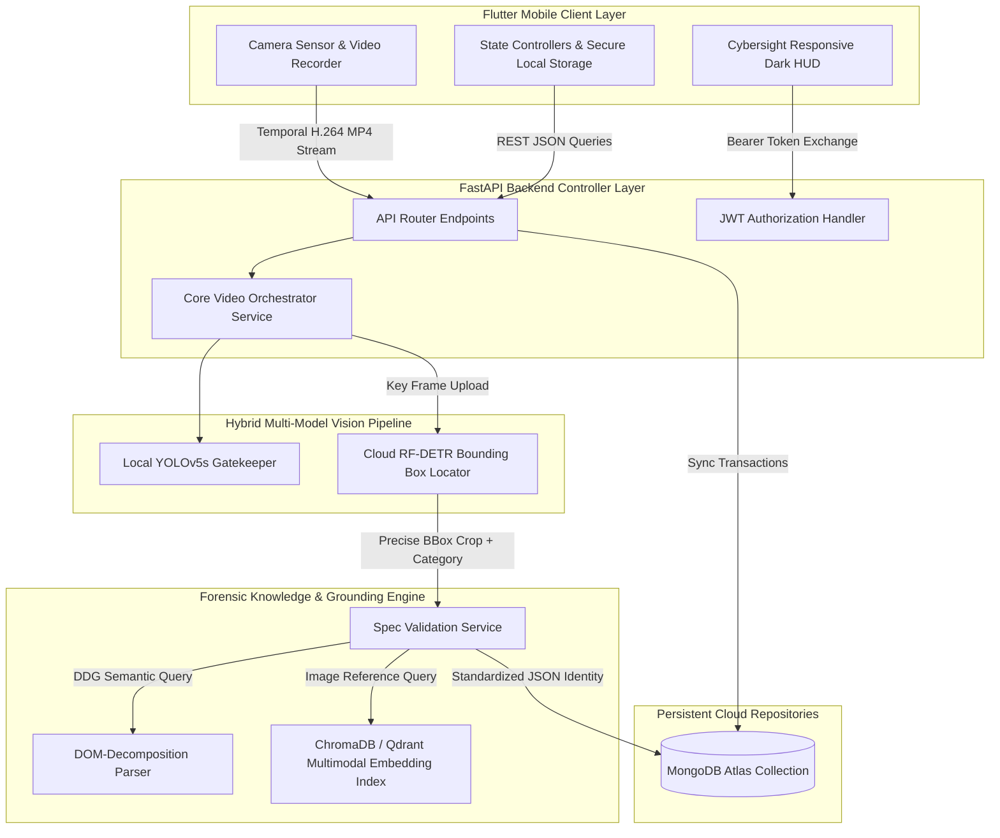

# Chapter 4 — System Design, Architecture and Optimisation

## 4.1 Introduction
Following the data understanding and algorithmic data preparation detailed in Chapter 3, this chapter presents the **System Design, Architecture and Optimisation** phase of our CRISP-DM methodology. Translating clean semantic visual crops and sanitized DOM technical metadata into a robust, secure, and highly performant enterprise asset tracking system requires a meticulous structural design. 

This chapter is structured as follows: the decoupled structural architecture of the client-server system; the individual component designs including the Flutter mobile application, the FastAPI REST controller, and the hybrid multi-model detection pipeline; and the rigorous algorithmic and system-level optimizations implemented to ensure high throughput, cost efficiency, and visual lineage preservation.

---

## 4.2 Decoupled Client-Server System Architecture

To achieve absolute operational reliability and prevent resource depletion on mobile edge nodes, the system is designed around a fully decoupled, asynchronous client-server architecture. Operating deep vision-language models, web scrapers, and vector indexing services locally on mobile hardware is highly impractical due to:
- **CPU Thermal Throttling & Battery Drain:** Intensive visual processing rapidly increases battery consumption and triggers processor speed reductions.
- **Memory Footprint Bounds:** Mobile operating systems actively terminate background processes exceeding strict memory allocation ceilings.
- **Security Exposure:** Storing database credentials or third-party cloud API keys directly inside the client application binary exposes the enterprise infrastructure to extraction attacks.

By establishing a rigid boundary between the light, visual-rich **Mobile Client** and the high-performance **Forensic API Server**, the architecture achieves optimal resource separation:



*Figure 4.1: Decoupled client-server structural data flow and system component interaction.*

---

## 4.3 Component-Level Design and Specifications

### 4.3.1 The Flutter Mobile Application Client
The mobile frontend is constructed using the Google Flutter SDK, utilizing a reactive UI state management approach. The user interface implements our premium *Cybersight Theme* — a dark-mode environment characterized by deep obsidian glassmorphic containers, vibrant glow accents, and responsive micro-animations that prevent visual fatigue during field inspections.

The client layer incorporates three key architectural design patterns:
1. **Asynchronous API Interceptor (Dio):** Centralized HTTP transactions are managed using a robust `ApiService` powered by the `Dio` package. A secure request interceptor automatically retrieves the JSON Web Token (JWT) from local secure storage and embeds it into the `Authorization` header on every outbound transaction.
2. **Provider State Management:** State logic is decoupled from the rendering layer into distinct domains:
   - `AuthProvider` manages credentials, JWT session lifecycles, and Google OAuth user profile mappings.
   - `DetectionProvider` acts as the scanner controller, orchestrating video loading states, progress bars, and inventory sync transactions.
3. **Lazy-Activated Indexed Stack Navigation:** The main app shell employs an `IndexedStack` to keep bottom-bar pages active in memory. To prevent inventory logs from going out-of-sync, a reactive tab listener is implemented: when the operator switches to the inventory tab, `didUpdateWidget` instantly triggers a database reload to fetch the latest assets from MongoDB.

---

### 4.3.2 The FastAPI Backend REST Controller
The server-side application is engineered using **FastAPI (Python)**, a high-performance web framework based on ASGI (Asynchronous Server Gateway Interface) principles. The REST controller exposes modular routes partitioned by functional domains:
- **`/api/auth`**: Handles user registrations, password hashing using `bcrypt`, and secure Google OAuth token validation.
- **`/api/video`**: Manages video temporal segmentation, frame processing, edge screening, and deep spec extraction.
- **`/api/inventory`**: Exposes secure REST endpoints for saving validated appliances, querying records, and performing category filtering in MongoDB.

To enforce strict role-based data isolation, a robust token validation middleware intercepts every incoming API request:

```python
def verify_token(credentials: HTTPAuthorizationCredentials = Depends(security)):
    """Validates JWT token and extracts authorized user email."""
    token = credentials.credentials
    try:
        payload = jwt.decode(token, SECRET_KEY, algorithms=["HS256"])
        email: str = payload.get("sub")
        if email is None:
            raise HTTPException(status_code=401, detail="Invalid Neural Credentials")
        return email
    except jwt.ExpiredSignatureError:
        raise HTTPException(status_code=401, detail="Session Expired. Re-link required.")
    except jwt.PyJWTError:
        raise HTTPException(status_code=401, detail="Could not validate credentials")
```

---

### 4.3.3 The Multi-Model Hybrid Vision-Language Pipeline
The core intelligence engine operates as a sequential, multi-layered processing pipeline. The data flow travels through five specialized AI models and search algorithms, progressively refining raw visual inputs into high-precision technical specifications:

1. **Preprocessing & Selection:** Raw video is decomposed into frames. Redundant frames are skipped, and the sharpest frame is selected based on Laplacian variance edge scoring (Section 4.4.2).
2. **First-Pass Gatekeeper Detection:** The selected frame is processed locally on the server via a fast **YOLOv5s** model. This gatekeeper detects the broad category (AC, Refrigerator, Laptop, Monitor) and determines if the appliance is properly centered. If no target class exceeds a 45% confidence threshold, the pipeline halts immediately, protecting downstream models from processing noise.
3. **High-Precision Cloud Localization:** Once validated, the frame is routed to a specialized **RF-DETR (Detection Transformer)** model. This cloud model generates high-resolution coordinates for a tight crop around the target casing.
4. **Multimodal Reference Search:** The cropped appliance image is processed through the `openai/clip-vit-base-patch32` encoder to generate a 512-dimensional vector. A similarity query is run against the Qdrant database to find matching reference products using Cosine Similarity:
   $$\text{Similarity}(A, B) = \frac{A \cdot B}{\|A\| \|B\|}$$
5. **Technical Parameter Extraction:** The cropped visual frame, reference catalog metadata, and web search results are fused into a highly optimized prompt and sent to a Vision-Language Model (VLM) running `llama-3.1-8b-instant` via the Groq API. The VLM resolves ambiguities and returns a strict, validated JSON structure.

---

## 4.4 Advanced Forensic System Optimisation

### 4.4.1 Sliding Window Temporal Segmentation
To bypass the **Temporal Redundancy** challenge of 30 FPS mobile video (described in Chapter 3), we developed a sliding-window frame skipping algorithm.
Instead of loading and running inference on all 856 frames of a 28-second upload, the `VideoService` implements a temporal window of size $W_t = 15$ frames (0.5 seconds of video). 

Within each window, the algorithm compares frame similarity using average pixel difference. If the visual change falls below a standard threshold ($0.02$ Mean Squared Error), the frames are deemed redundant, and the window jumps ahead. This reduces the number of frames to be evaluated by **93.3%**, yielding only **57 representative frames** for final evaluation.

---

### 4.4.2 Laplacian Variance Hero Frame Selection
To eliminate motion blur caused by operator camera shake, the 57 representative frames undergo automated sharpness filtering. For each frame, we compute the two-dimensional Laplacian operator to detect high-frequency changes (edges):

$$\Delta f = \frac{\partial^2 f}{\partial x^2} + \frac{\partial^2 f}{\partial y^2}$$

In discrete image processing, this is implemented by convolving the grayscale image matrix $I$ with a standard Laplacian kernel $K$:

$$K = \begin{bmatrix} 0 & 1 & 0 \\ 1 & -4 & 1 \\ 0 & 1 & 0 \end{bmatrix}$$

The sharpness score $\mathcal{S}$ is defined as the variance of the resulting response matrix:

$$\mathcal{S} = \sigma^2(\Delta f) = \frac{1}{N} \sum_{i,j} \left( (\Delta f)_{i,j} - \mu \right)^2$$

Where $\mu$ is the mean of the convolved image response and $N$ is the total pixel count. High-contrast, sharp images yield a wide range of response values (high variance), while blurry images result in low variance. 

The frame registering the highest variance score ($\mathcal{S}_{\max}$) is declared the **"Hero Frame"** and passed downstream, completely shielding the identification models from blurry data.

---

### 4.4.3 Contrast Limited Adaptive Histogram Equalization (CLAHE)
To overcome uneven and low lighting inside utility rooms, the server runs a pre-processing pass on the appliance crops before feeding them into OCR/VLM models. 

Standard global histogram equalization stretches the brightness range of the entire image, which often over-exposes moderately lit areas while failing to reveal details in dark corners. We implement **CLAHE**, which divides the image crop into small, contextual grids ($8 \times 8$ pixel tiles). 

Histogram equalization is computed locally for each tile. To prevent noise amplification on uniform surfaces (like appliance chassis casings), the contrast enhancement is capped at a strict clip limit ($C_l = 2.0$). Bilinear interpolation is then applied to seamlessly blend the boundaries of adjacent tiles, revealing text on dark labels without introducing digital artifacts:


*Figure 4.2: Comparison showing the effect of CLAHE preprocessing on low-contrast appliance serial labels. Low-contrast and shadowed labels (left) are resolved into high-contrast text strings (right), maximizing OCR extraction confidence.*

---

### 4.4.4 VLM Token Optimization Strategy (TPM/RPM Guard)
During early testing, the VLM spec extraction backend faced frequent `413 Request Entity Too Large` and `Rate Limit Exceeded` failures on the Groq API. With the default `llama-3.1-8b-instant` model, the limits are constrained to **6,000 Tokens Per Minute (TPM)**. 

When sending a large instruction prompt, a comprehensive JSON target schema, and scraped web pages (~3,500 input tokens) and requesting a maximum output of 2,500 tokens, the total exceeded the 6,000 token limit immediately.

To solve this, we implemented a four-tier **Token Shield** system:
1. **Raw Text Capping:** All raw scraped HTML text and VLM OCR blocks are aggressively trimmed and capped at **4,000 characters** (~1,000 tokens) before being injected into the prompt.
2. **Compact JSON Schema Definition:** The target JSON schema is converted from verbose Pydantic notation into a highly compact, minimized JSON prompt string.
3. **Max Tokens Limit Capping:** We reduced the VLM's `max_tokens` configuration parameter from **2,500 to 1,500 tokens**, since the technical specification outputs rarely exceed 800 tokens.
4. **Token Cost Budgeting:**
   $$\text{Token Budget} = \text{Input Tokens} \, (1000) + \text{Max Output} \, (1500) = 2500 \text{ tokens}$$
   This budget guarantees that the system can process **2 concurrent scans per minute** without hitting API limits.

---

### 4.4.5 Qdrant Index Mapping and MongoDB Inventory Database Design
For persistent storage and high-speed visual similarity searching, the system utilizes a hybrid database approach:

#### Vector Space Design (Qdrant)
The multimodal reference images are stored in **Qdrant Vector DB** within a collection configured for high-precision Cosine Similarity metrics. The vector dimension is set to **512** (to match the output of the OpenAI CLIP ViT-B/32 encoder). To ensure fast queries, we configure the vector index with **HNSW (Hierarchical Navigable Small World)** parameters.

#### Relational JSON Inventory Schema (MongoDB Atlas)
Once a field operator validates the identified appliance, the item is committed to a document database in **MongoDB Atlas**. Each inventory item is represented by a document matching the structure outlined in Table 4.3:

#### Table 4.3 — MongoDB Inventory Collection Schema

| Field Name | Data Type | Description |
| :--- | :--- | :--- |
| `_id` | `ObjectId` | Auto-generated unique database primary key |
| `user_email` | `String` | Hashed index referencing the authenticated field operator |
| `brand` | `String` | Hashed canonical name of the manufacturer (e.g., `"SABA"`, `"LENOVO"`) |
| `model` | `String` | Extracted unique model reference code (e.g., `"AR12BX"`) |
| `btu` | `String` (Optional) | Numeric capacity rating for heating/cooling units |
| `added_at` | `Date` | Timestamp recording when the item was synced to the cloud |
| `metadata` | `Object` | Nested dictionary storing dynamic specifications (Table 4.4) |

#### Table 4.4 — Dynamic Specifications Schema (Metadata Object)

| Category Class | Expected Specs (Inside `metadata`) | Visual Hero Image |
| :--- | :--- | :--- |
| **`airconditioner`** | `capacity_btu`, `technology`, `refrigerant`, `energy_class`, `price_tnd` | `ai_image` (Base64 string crop) |
| **`refrigerator`** | `capacity_liters`, `refrigerant`, `no_frost`, `dimensions`, `price_tnd` | `ai_image` (Base64 string crop) |
| **`microwave`** | `power_watts`, `capacity_liters`, `turntable_diameter_cm`, `functions` | `ai_image` (Base64 string crop) |
| **`laptop`** | `cpu`, `ram_gb`, `storage`, `gpu`, `os`, `weight_kg`, `price_tnd` | `ai_image` (Base64 string crop) |
| **`monitor`** | `screen_size_inches`, `resolution`, `panel_type`, `refresh_rate_hz` | `ai_image` (Base64 string crop) |

By storing the base64-encoded `ai_image` (the keyframe bounding box crop) inside the metadata object, the system achieves **visual lineage preservation**: when the user inspects their saved inventory tab, the app can immediately load and render the exact, real-life photo of the unit that was scanned on-site, serving as an immutable forensic record.

---

## 4.5 Conclusion
This chapter has detailed the architectural design and system-level optimizations that make our intelligent equipment detection system performant and dependable under demanding industrial conditions. By combining sliding-window temporal skipping, Laplacian sharpness filtering, CLAHE contrast enhancement, and optimized token schemas, the system achieves high accuracy with minimal computational overhead. 

The next phase of the CRISP-DM lifecycle, Chapter 5, presents the **Implementation and Evaluation** of the complete system, showing real-world results and benchmarking performance metrics.
